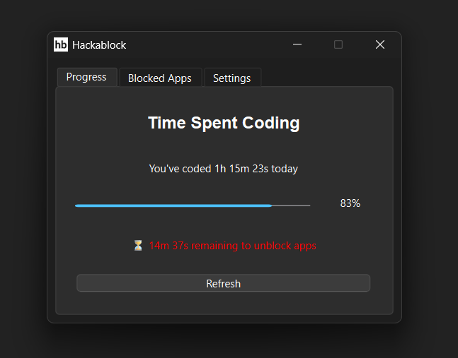

# hackablock


A productivity program that will block apps until you've coded enough on Hackatime everyday.

This is only for Windows. Linux and MacOs are not fully supported as I want native process watching and haven't had time to implement that.



## Features

-   Tracks daily coding time (configurable requirement)
-   System tray icon that runs in the background
-   Notifications when goals are met or apps are blocked
-   Automatic termination of blocked apps
-   Persistant settings

## Building from Source

- You will need Python 3.12+:

    -   Download and install from [python.org/downloads](https://www.python.org/downloads/)
    -   During installation, ensure you check "Add Python to PATH."
    -   You can check your Python version by running `python --version` or `python3 --version` in your terminal.

### Build Process

```bash
git clone https://github.com/Brooklyn-Dev/hackablock.git
cd hackablock

# Create a virtual environment
python -m venv venv

# Activate the virtual environment (Windows)
.\venv\Scripts\activate

# Install all required Python libraries
pip install -r requirements.txt

# Run the program
python -m src.main
```

## Usage

You must enter your hackatime API key for the program to work. Hence, this program requires an internet connection to fetch coding time data.

-   Open GUI and view logs using the system tray icon
-   Track coding time in Progress tab
-   Set apps to block in Blocked Apps tab
-   Configure API key and required time in Settings tab
-   View logs to help troubleshoot any issues

## Like this project?

If you find this project interesting or useful, consider giving it a star ⭐️!

## License

This project is licensed under the MIT License. See [LICENSE](LICENSE) for more information.
